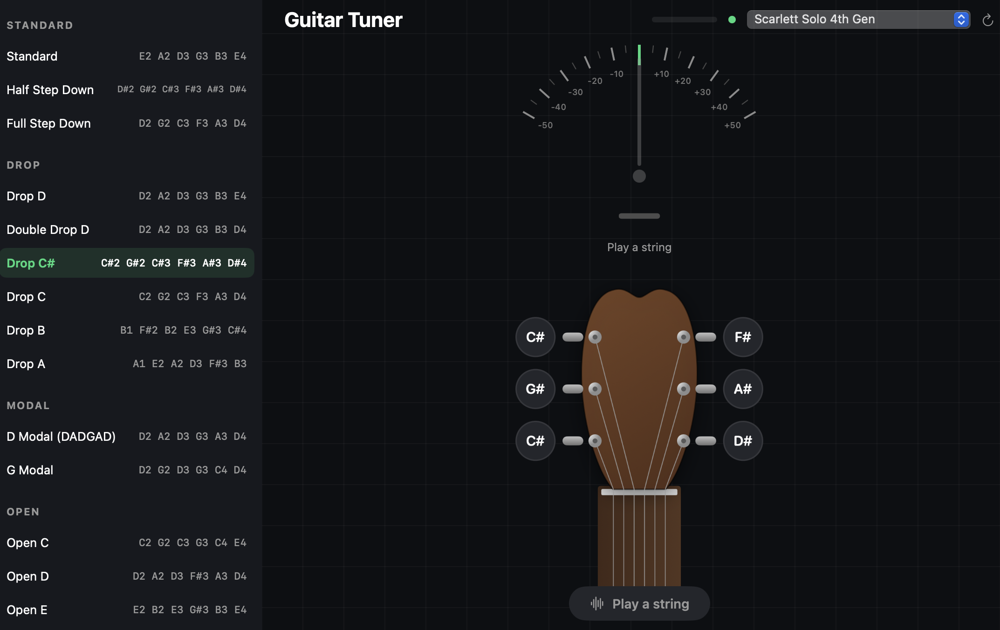
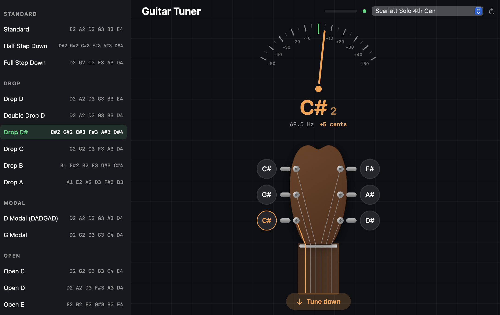
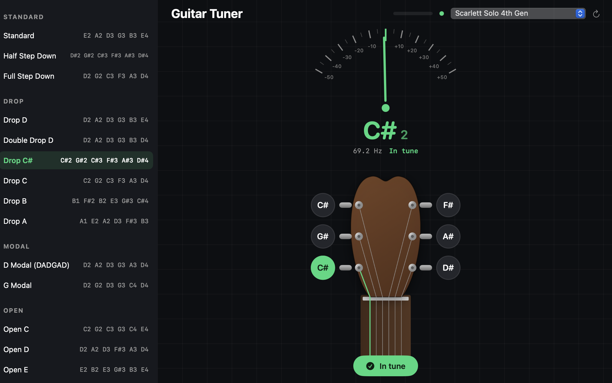

# Guitar Tuner

Native guitar tuner for macOS. Pluck a string — the app detects which string you’re playing and shows a needle for how far off you are (in cents).

Built with Swift + SwiftUI. Pitch detection uses the YIN algorithm (no external dependencies).

## Demo

**Start screen** - pick a tuning and input device, then play a string.



**Tuning** - the needle shows how many cents off you are; the active string is highlighted and the app tells you which way to turn the peg.



**In tune** - hold the note steady and the string is marked with a checkmark.



## Download

Pre-built DMG on the releases page:

**[github.com/Letch49/guitar-tuner/releases](https://github.com/Letch49/guitar-tuner/releases)**

Open the DMG and drag Guitar Tuner into Applications. The app is ad-hoc signed, so on first launch use **Right click → Open**. Allow microphone access when prompted — macOS requires it for any audio input, including audio interfaces.

## Input devices

| Source | Status |
|--------|--------|
| **Audio interface (Focusrite)** | Tested and works well. Focusrite Scarlett Solo (4th Gen) was the only interface used during development — other brands/models are untested. |
| **Built-in Mac microphone** | Works, but less reliable than a direct input. Low strings and quiet signals are harder to detect. |
| **Bluetooth / Continuity mic (e.g. iPhone)** | Untested; may work with the same limitations as the built-in mic. |

For serious tuning, a direct guitar → interface connection is strongly recommended.

## Tunings

Notes are listed from **string 6 (lowest)** to **string 1 (highest)**.

### Standard

| Tuning | String 6 → String 1 |
|--------|---------------------|
| Standard | E2 A2 D3 G3 B3 E4 |
| Half Step Down | D#2 G#2 C#3 F#3 A#3 D#4 |
| Full Step Down | D2 G2 C3 F3 A3 D4 |

### Drop

| Tuning | String 6 → String 1 |
|--------|---------------------|
| Drop D | D2 A2 D3 G3 B3 E4 |
| Double Drop D | D2 A2 D3 G3 B3 D4 |
| Drop C# | C#2 G#2 C#3 F#3 A#3 D#4 |
| Drop C | C2 G2 C3 F3 A3 D4 |
| Drop B | B1 F#2 B2 E3 G#3 C#4 |
| Drop A | A1 E2 A2 D3 F#3 B3 |

### Modal

| Tuning | String 6 → String 1 |
|--------|---------------------|
| D Modal (DADGAD) | D2 A2 D3 G3 A3 D4 |
| G Modal | D2 G2 D3 G3 C4 D4 |

### Open

| Tuning | String 6 → String 1 |
|--------|---------------------|
| Open C | C2 G2 C3 G3 C4 E4 |
| Open D | D2 A2 D3 F#3 A3 D4 |
| Open E | E2 B2 E3 G#3 B3 E4 |
| Open G | D2 G2 D3 G3 B3 D4 |
| Open A | E2 A2 E3 A3 C#4 E4 |

## Build from source

Requires macOS 13+ and Xcode Command Line Tools (`xcode-select --install`).

```bash
./build.sh             # build build/GuitarTuner.app
./build.sh install     # build and install to /Applications
./build.sh dmg         # build and create build/GuitarTuner.dmg
```

## Release

Releases are published automatically via GitHub Actions. Push a tag like `v1.0.0` — CI builds the DMG and attaches it to the release.

```bash
git tag v1.0.0 && git push origin v1.0.0
```
